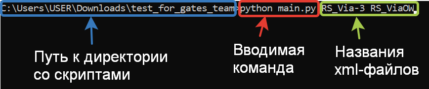

# Сравниваем файлы с рейсами

Скрипт сравниает два xml-файла с рейсами и выводит в терминал их отличия

### Как установить

Для работы скрипта нужно иметь два xml-файла, в которых содержатся данные 
о рейсах (в этом репозитории это файлы RS_Via-3.xml и RS_ViaOW.xml)

Python3 должен быть уже установлен. 
Затем используйте `pip` (или `pip3`, есть есть конфликт с Python2) для установки зависимостей:
```
pip install -r requirements.txt
```

Запустить скрипт можно через командную строку:



### Цель проекта

Код написан в образовательных целях на онлайн-курсе для веб-разработчиков [dvmn.org](https://dvmn.org/).